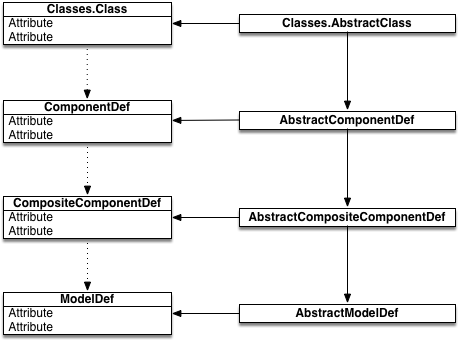

# Classes.jl

## Functions emitted by the @class macro

The `@class` macro emits several functions, including constructors, initializers, and support methods.

### Constructors

* "All fields" constructor

  This constructor takes as arguments all the fields accumulated through superclasses, in
  the order defined, and calls `new()` on the args. This simply duplicates the default
  constructor, which is necessary since we define other "inner" constructors and initializers.

### Initializers

Initializers are functions that set values on an existing class instance. These come
in several forms:

* "All fields" initializer

  Similar to the "all fields" constructor except that it takes an object that must
  be a class or subclass of the defined class.

* "Local fields" initializer

  Takes an instance of the class (or subclass thereof) and initializes only the fields newly
  defined by the current class. This is provided to support custom initializers that can
  chain from subclasses to superclasses.

* "Superclass copy" initializer

  Provided primarily to support immutable classes (but available to mutable classes as well),
  this initializer takes as arguments all locally-defined fields plus an instance of the 
  immediate superclass of the present class, from which values are copied into a call to
  `new` on the present class.

### Support methods

#### Structure field accessor function

* By default, the `@class` macro generates "getter" and "setter" functions
  for all locally defined fields in each class. For example, For a class `Foo` with local field 
  `foo::T`, two functions are generated:

  ```
    # "getter" function
    get_foo(obj::_Foo_) = obj.foo

    # "setter" function
    set_foo!(obj::_Foo_, value::T) = (obj.foo = foo)
  ```
  Note that these are defined on objects of type `_Foo_`, so they can be used on `Foo`
  and any of its subclasses.

Whether to emit these functions, and, if so, how to name them can be controlled by
passing a tuple of "meta-parameters" after the class name in the call to `@class`,
as in this example:

```
@class ClassName(setters=false, getter_prefix="") <: SuperClass ... 
```

Use this to set the following options (the default values are shown):
```
    mutable = false          # Whether to generate a mutable struct
    setters = true           # Whether to generate setter functions
    getters = true           # Whether to generate getter functions
    getter_prefix = "get_"   # Prefix to use for getter functions
    getter_suffix = ""       # Suffix to use for getter functions
    setter_prefix = "set_"   # Prefix to use for setter functions
    setter_suffix = "!"      # Suffix to use for setter functions
```

Names of getter and setter methods for a field `foo` are composed as follows:

```
    $(getter_prefix)foo$(getter_suffix) # getter name for `foo`
    $(setter_prefix)foo$(setter_suffix) # setter name for `foo`
```

If both meta-args and type parameters are used in the class definition, the meta-args
must come between the class name and the type parameters, e.g.,

```
@class Foo(mutable=true, setters=false){T <: SomeClass} begin
    i::Int
    f::Float64
end
```

#### The 'mutable' keyword

Class mutability can be specified two ways:
1. As a keyword before the class name, as in `@class mutable MyClass ...`
2. In the meta-args, as in `@class MyClass(mutable=true)`

Note that disagreement between the explicit keyword and the meta-args is not allowed:
`@class mutable Foo(mutable=false)` will raise an error, whereas `@class mutable Foo(mutable=True)`
and `@class Foo(mutable=false)` are valid (and redundant.)


#### Reflection methods

* `issubclass(class, superclass)`

   For all superclasses of the newly defined class, a method of `issubclass` is emitted that
   returns `true` for the new class and its superclasses.

* `superclass(class)`

   Returns the superclass of the newly defined class.

* `show_all_accessors()`

  Prints a list of all accessor functions generated for all classes.

* `show_accessors(class)`

  * Prints a list of the accesor functions generated for `class`, which
    can be a symbol or the type of a concrete class.

### Example

```
using Classes

@class Foo <: Class begin
   foo::Int

   Foo() = Foo(0)

   # Although Foo is immutable, subclasses might not be,
   # so it's still useful to define this method.
   function Foo(self::absclass(Foo))
        self.foo = 0
    end
end

@class mutable Bar <: Foo begin
    bar::Int

    # Mutable classes can use this pattern
    function Bar(self::Union{Nothing, absclass(Bar)}=nothing)
        self = (self === nothing ? new() : self)
        superclass(Bar)(self)
        Bar(self, 0)
    end
end
```

Produces the following methods:
```
# Custom constructors defined inside the @class above
Foo()
Foo(self::_Foo_)

#
# Methods emitted by @class macro for Foo
#

# all-fields constructor
Foo(foo::Int64)

# local-field initializer
Foo(self::T, foo::Int64) where T<:_Foo_ 

# field accessors
get_foo(obj::_Foo_) = obj.foo
set_foo!(obj::_Foo_, value::Int) = (obj.foo = value)

# Custom constructor defined inside the @class above
Bar()

# Custom initializer defined inside the @class above
Bar(self::Union{Nothing, _Bar_})

#
# Methods emitted by @class macro for Bar
#

# all-fields constructor
Bar(foo::Int64, bar::Int64)

# local-fields initializer
Bar(self::T, bar::Int64) where T<:_Bar_

# all fields initializer
Bar(self::T, foo::Int64, bar::Int64) where T<:_Bar_  

#  Superclass-copy initializer 
Bar(bar::Int64, s::Foo)

# field accessors
get_bar(obj::_Bar_) = obj.bar
set_bar!(obj::_Bar_, value::Int) = (obj.bar = value)
```

## Example from Mimi

The following diagram shows the relationship between the concrete structs and abstract types create by the `@class` macro. Solid lines indicate subtype relationships; dotted lines indicate
subclass relationships, which exist outside the julia type system.



Each class as a corresponding "shadow" abstract supertype (of the same name surrounded by underscores) which is a parent to all abstract supertypes of its subclasses. The subclasses of, say, `ComponentDef` are all subtypes of `_ComponentDef_`, thus methods defined as

```
@method function foo(obj::ComponentDef)
    ...
end
```

are emitted essentially as the following:

```
function foo(obj::T) where {T <: _ComponentDef_}
    ...
end
```

So the `foo` method can be called on any subclass of `ComponentDef`. The user deals only with the concrete types; the abstract types are created and used only by the `@class` and `@method` macros.

